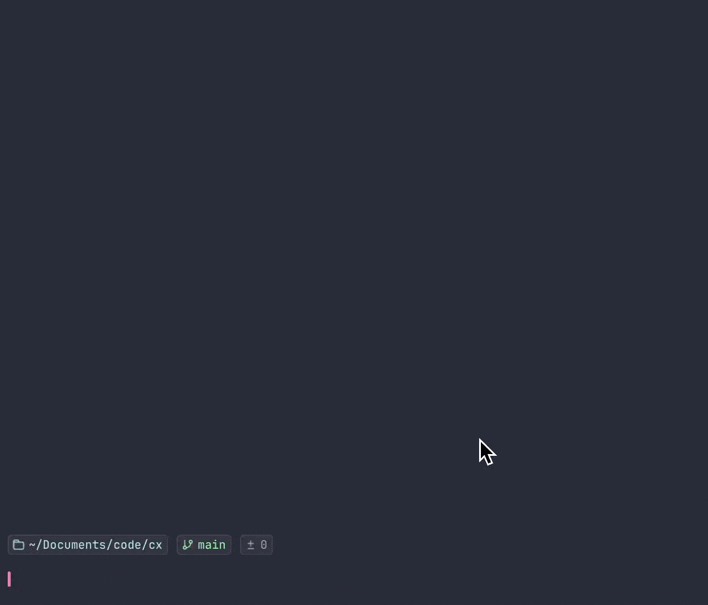

<div align="center">

# cx

**为 Codex CLI 提供更顺手的交互式启动器**


一条命令启动，动态补全参数，减少重复输入

[简介](#简介) • [安装](#安装) • [使用](#使用) • [开发](#开发)

</div>

---

## 简介

cx 是一个轻量级命令行启动器，用来简化 Codex CLI 的启动流程。

<p align="center">
  
</p>

### 功能特性

- 交互式菜单启动 Codex
- 已传入的参数自动跳过，不重复询问
- 支持 `reasoning` / `yolo` / `model` 动态补全
- 支持在交互菜单中回退上一步
- 检测到 `fzf` 时默认启用增强交互
- 支持 `macOS` / `Linux`
- 支持 `bash` / `zsh`

## 安装

### 环境要求

- 已安装 `codex`
- `bash` 可用
- `fzf` 可选，安装后会自动启用增强交互

### 快速安装

```bash
curl -fsSL https://raw.githubusercontent.com/Shadowzzh/cx/main/scripts/install.sh | bash
```

### 手动安装

```bash
git clone https://github.com/Shadowzzh/cx.git
cd cx
bash scripts/install.sh
```

### 卸载

```bash
curl -fsSL https://raw.githubusercontent.com/Shadowzzh/cx/main/scripts/uninstall.sh | bash
```

```bash
bash scripts/uninstall.sh
```

## 使用

### 基础示例

```bash
cx
cx yolo
cx gpt-5.5
cx xhigh
cx gpt-5.4
cx yolo xhigh
cx yolo xhigh gpt-5.4
cx no-yolo high
```

### 规则说明

1. 传了什么参数，就跳过对应菜单
2. 缺什么参数，就只补什么菜单
3. 三个维度都齐了，就直接启动

### 菜单回退

- 从第二个交互步骤开始，可输入 `b` 或 `back` 返回上一步
- `fzf` 菜单支持 `ctrl-b` 返回上一步
- 同时提供显式菜单项 `返回上一步`
- 仅能回退当前这次交互里实际出现过的步骤

### 默认值

- `reasoning`: `medium`
- `yolo`: `yes`
- `model`: `gpt-5.4`

### 支持的思考等级

- `low`
- `medium`
- `high`
- `xhigh`

### 支持的 model

- `gpt-5.5`
- `gpt-5.4`
- `gpt-5.3-codex`
- `gpt-5.2-codex`
- `gpt-5.1-codex-max`
- `gpt-5.2`
- `gpt-5.1-codex-mini`

## 开发

### 项目结构

```text
├── bin/
│   └── cx
├── scripts/
│   ├── install.sh
│   └── uninstall.sh
├── tests/
│   └── cx_smoke_test.sh
├── docs/
│   ├── demo.gif
│   └── logo.svg
└── .github/
    └── workflows/
        └── smoke.yml
```

### 本地检查

```bash
bash -n bin/cx
bash -n scripts/install.sh
bash -n scripts/uninstall.sh
bash tests/cx_smoke_test.sh
```

### 设计原则

- 核心逻辑保持单文件，方便安装和维护
- 安装脚本只做最小配置，不隐式修改太多用户环境
- 交互保持轻量，`fzf` 作为可选增强，未安装时回退 shell 原生能力
